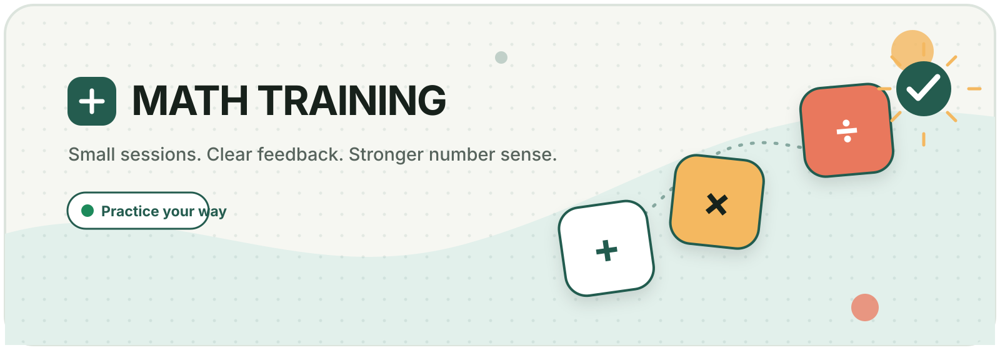

<p align="center">
  
</p>

<p align="center">
  <a href="https://dmoliveira.github.io/ai-math-training/"></a>
  <a href="https://github.com/dmoliveira/ai-math-training/actions/workflows/ci.yml"></a>
  <a href="https://github.com/dmoliveira/ai-math-training/actions/workflows/pages.yml"></a>
  <a href="./LICENSE"></a>
</p>

# Math Training 🧠➕

A focused, friendly browser app for building everyday arithmetic fluency. Choose your number size, operations, expression length, and session size—then practise with fast keyboard input and calm feedback.

**[Start practising →](https://dmoliveira.github.io/ai-math-training/)**

## Why it is useful ✨

| | Feature | What it gives you |
| --- | --- | --- |
| 🎛️ | **Flexible sessions** | Choose 1–5 digit operands, 1–4 operators, and 1–50 questions. |
| ➕➖ | **Four operations** | Practise addition, subtraction, multiplication, and exact division. |
| 🔀 | **Same or mixed** | Repeat one operation or combine selected operations with standard precedence. |
| ⌨️ | **Keyboard first** | Use a keyboard, number pad, or the accessible on-screen keypad. |
| ✅ | **Helpful feedback** | Retry mistakes, reveal one answer, and review missed questions at the end. |
| ⏱️ | **Sprint results** | See active and scored time, skips, first-try accuracy, rankings, and seven-day trends. |
| 🔒 | **Private by default** | Settings and active progress use versioned `localStorage`; completed history uses IndexedDB. There are no accounts or trackers. |
| ♿ | **Accessible and responsive** | Semantic controls, visible focus, reduced motion, and layouts tested from 320px upward. |

## How to practise 🚀

1. **Build a session** — choose a minimum and maximum digit count, operations, operators per question, pattern, and question total.
2. **Solve each expression** — type an answer or use the on-screen keypad, then press <kbd>Enter</kbd>.
3. **Review your run** — compare scored time, top-five results, daily statistics, and private on-device history.
4. **Share if you choose** — use native sharing, copy, or ordinary social links. Sharing never happens automatically.

Your active session is restored after a refresh. **Save & exit** pauses the timer and keeps your exact place on this device.

### Keyboard controls ⌨️

| Key | Action |
| --- | --- |
| <kbd>0</kbd>–<kbd>9</kbd> | Enter answer digits |
| <kbd>Enter</kbd> | Check an answer or move to the next question |
| <kbd>Backspace</kbd> / <kbd>Delete</kbd> | Edit normally |
| <kbd>−</kbd> | Remove the last digit |
| <kbd>×</kbd> / <kbd>*</kbd> | Clear the answer |
| <kbd>Escape</kbd> | Clear the answer, or close an open confirmation dialog |

## Math rules 📐

- **Digit range:** `1–2 digits` samples operands with one or two digits; `3 digits` keeps every operand between `100` and `999`.
- **Expression length:** one operator means two numbers; four operators means five numbers.
- **Same mode:** one selected operation repeats inside each question.
- **Mixed mode:** at least two selected operations appear, using standard order of operations.
- **Answers:** every generated result is an exact, non-negative whole number. BigInt arithmetic keeps large answers precise.
- **Division:** divisors are never zero and division never requires rounding. The setup explains when a repeated-division range cannot produce a whole-number exercise.

## Run it locally 🛠️

### Requirements

- [Node.js 24](https://nodejs.org/) (Node `22.12+` is supported)
- npm (included with Node.js)

```bash
git clone https://github.com/dmoliveira/ai-math-training.git
cd ai-math-training
npm ci
npm run dev
```

Open the local URL printed by Vite.

### Project commands

| Command | Purpose |
| --- | --- |
| `npm run dev` | Start the development server |
| `npm run lint` | Run ESLint |
| `npm test` | Run Vitest unit tests |
| `npm run test:e2e` | Run Playwright browser, responsive, and accessibility tests |
| `npm run build` | Type-check and create the production build |
| `npm run check` | Run lint, enforced test coverage, type-check, and build |
| `make help` | Show the matching Makefile shortcuts |

Install the Playwright browser once before the first end-to-end run:

```bash
npx playwright install chromium
npm run test:e2e
```

## How it works 🧩

```text
src/math/       deterministic BigInt exercise generation
src/state/      session, scoring, reveal, and timer transitions
src/storage/    validated localStorage and IndexedDB adapters
src/app.ts      accessible setup, practice, and completion UI
src/style.css   responsive visual system and reduced-motion states
e2e/            keyboard, persistence, responsive, and Axe checks
```

The app is a dependency-light Vite + TypeScript static site. It has no backend and sends no practice data anywhere automatically. Sharing and creator/support destinations are explicit user-activated external links; Stripe handles optional payment details under its own privacy terms.

## Deployment 🌍

Every merge to `main` runs the complete validation suite and deploys `dist/` through the official GitHub Pages Actions flow. The Vite base is fixed to `/ai-math-training/` for this project site.

- Live app: <https://dmoliveira.github.io/ai-math-training/>
- Deployment workflow: [`.github/workflows/pages.yml`](./.github/workflows/pages.yml)

## Contributing 🤝

Issues and focused pull requests are welcome. Please run these checks before opening a PR:

```bash
npm run check
npm run test:e2e
```

Use [GitHub Issues](https://github.com/dmoliveira/ai-math-training/issues) for bugs and future practice ideas so the core experience stays simple.

## License 📄

Released under the [MIT License](./LICENSE).
